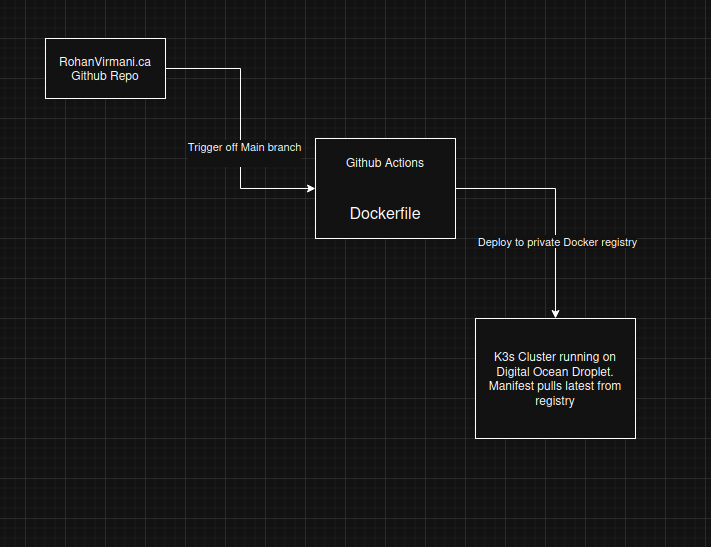

### Streamlining The Deployment

In today's development landscape, getting your code from commit to production efficiently and reliably is paramount. This diagram outlines a powerful and popular Continuous Integration/Continuous Deployment (CI/CD) pipeline that leverages a set of industry-standard tools. Let's break down each component and understand how they work together to automate the deployment of this portfolio website.

This website is hosted on a self hosted DigitalOcean droplet hosting via Nginx on a k3s cluster.

## 1. GitHub Repo: Your Code's Central Hub

At the very beginning of our pipeline is a GitHub Repository, specifically RohanVirmani.ca.
In this setup, the GitHub repository serves as the single source of truth for your application's code. Any changes pushed to the Main branch (or typically main or master) act as the trigger for our automated deployment process. This ensures that every deployment is based on the latest approved code.

## 2. GitHub Actions: Automating Your Workflow

Once changes are pushed to the Main branch of the GitHub Repo, GitHub Actions springs into action. GitHub Actions is a CI/CD service provided directly by GitHub, below is a sample of the workflow used.

```
name: Gatsby.js CI

on:
  push:
    branches: [ main ]

jobs:
  build:

    runs-on: ubuntu-latest

    steps:
    - uses: actions/checkout@v2

    - name: Log in to Docker Registry
      uses: docker/login-action@v3
      with:
        registry: docker.rohanvirmani.ca # Your registry domain
        username: ${{ secrets.DOCKER_USER_NAME }}
        password: ${{ secrets.DOCKER_PASSWORD }}
        
    - name: Build and push Docker image
      run: |
        docker build -t docker.rohanvirmani.ca/portfoliowebsite:latest .
        docker push docker.rohanvirmani.ca/portfoliowebsite:latest
      working-directory: portfolio-minimal
```

## 3. Dockerfile: Defining Your Application's Environment

Within the GitHub Actions workflow, the Dockerfile plays a crucial role. A Dockerfile is a text file that contains a set of instructions for building a Docker image. Docker images are lightweight, standalone, executable packages that include everything needed to run a piece of software, including the code, a runtime, system tools, libraries, and settings.

In this code base, docker is used to setup alpine Linux as a base to use Node.js and run npm commands. From there we use a nginx variant of alpine Linux to serve the static files generated by Gatsby.

## 4. Private Docker Registry: Storing Your Images Securely

After GitHub Actions successfully builds the Docker image from your Dockerfile, the next step is to Deploy to a private Docker registry. A Docker registry is a storage and distribution system for Docker images. While Docker Hub is a public registry, using a private registry offers several benefits:

    Security: Your images are not publicly accessible.
    Control: You have more control over who can access and pull your images.
    Performance: Faster image pulls within your own infrastructure.

This step ensures that your built application image is stored securely and is readily available for deployment to your production environment.

## 5. K3s Cluster running on Digital Ocean Droplet: Your Lightweight Production Environment

Finally, the deployed Docker image finds its home on a K3s Cluster running on a Digital Ocean Droplet. Let's unpack this:

    DigitalOcean Droplet: A Droplet is DigitalOcean's term for a virtual private server (VPS). It's a scalable and reliable cloud server that provides the computational resources for your application.
    K3s Cluster: K3s is a lightweight, certified Kubernetes distribution built for IoT and Edge computing. I set this up from scratch on a empty VPS.

  # Things that I configured on K3s
    -Traefik, the default ingress controller to connect the cluster to my Domain name Rohanvirmani.ca along with exposing the private Docker repo
    -A private Docker repository setup to host my portfolio website and various other images used for my own purposes. Exposed as docker.rohanvirmani.ca
    -Lets Encrypt to provide SSL certificate for my domain
    -a deployment manifest to deploy the pods and services needed to support RohanVirmani.ca

The beauty of this setup is that the Manifest pulls latest from registry. In a Kubernetes (and therefore K3s) environment, you define your application's desired state using YAML configuration files called manifests. These manifests specify details like which Docker image to run, how many replicas, networking, etc. When your image is updated in the private Docker registry, the K3s cluster can be configured to automatically pull the latest version of your image and update the running application.

After all the configuration, all that is needed to update the live application is a simple login and push to the docker repo. After this point K3 takes over and does the rest automatically.
